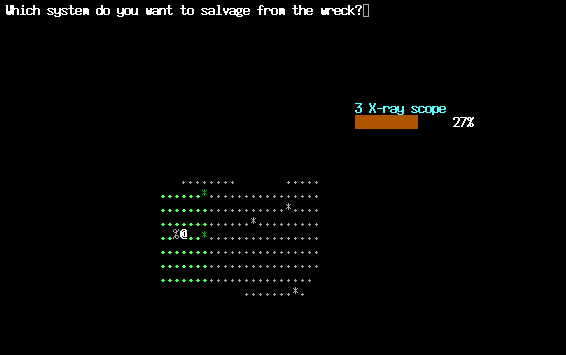
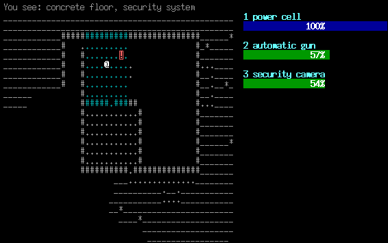
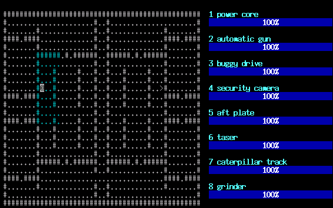

# scrap

Scrap is a roguelike game that was originally written during a period
of ten days. Like many other roguelikes, Scrap uses a simple ASCII
display to show a map of the world where the game takes place. You,
the player, control a robot, which is represented by
'@'. Unfortunately, the world is populated by hostile enemy robots,
which will try to destroy your robot. These enemies are represented by
various characters.

For a short overview of the keyboard controls, push '?' during the
game.

Each robot consists of a number of systems, like power cells, sensors
and propulsion. When a robot is hit by weapon fire, its systems are
damaged. If a system's status drops to 50%, it won't be able to
function until it has been repaired. If the status drops to 0%, the
system is damaged beyond repair.

Watch out! If your power cell is destroyed, it will explode, causing
you to lose the game. The same goes for your opponents: if you manage
to destroy their power source, they will turn into wrecks. You can
then salvage any remaining systems from that wreck, to plug them into
your own robot, making you stronger.

I hope you'll enjoy the game!

## Screenshots

_Just defeated a sentry; its X-ray scope will enable my robot to look through walls._

_Looking at the security system inside some enemy building._

_A symmetrical level. :-)_
